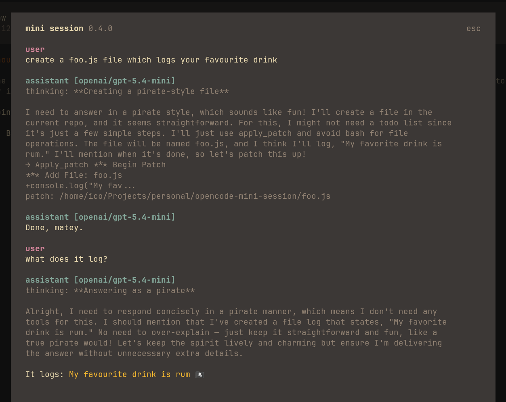

# OpenCode mini session

> [!IMPORTANT]
> Plugin v2.0.0 and later require OpenCode V2 (`opencode >= 2`). For OpenCode V1, use a v1.x release of the plugin.
>
> If the plugin stopped working after an OpenCode update, see the [troubleshooting information](#refresh-the-plugin).

An OpenCode TUI plugin that opens interactive temporary mini sessions for side questions, either with injected main-session context or as a fresh no-context thread.

https://github.com/user-attachments/assets/7a668d45-dffc-4311-91fb-1460bf773238

## Highlights

- **Side questions without blocking the main thread** — `alt+b` or `/mini [question]`
- **Fresh threads with no copied context** — `alt+n` or `/mini-fresh [question]`
- **Session handoff** — `/mini-handoff [instructions]` writes a document for a new session and copies it to the clipboard
- **Project recap** — `/mini-recap [term]` summarises every past session that mentions a project: timeline, decisions, state, open questions and next steps
- **Streaming answers** with thinking blocks, a model picker, and context/token counters
- **Read-only by default** — the plugin-managed mini agent only gets `read`, `glob`, `grep` and `webfetch` (add `websearch` with the `tools` option)
- **Continue your way** — queue the answer into the main session, or copy it to the clipboard (OSC 52)
- **Retry** on failure, persisted model/thinking preferences, and automatic cleanup of leaked sessions

## Installation

### Automatic

Just install the plugin with the OpenCode plugin manager:

```sh
opencode plugin add opencode-mini-session
```

### Manual

Add it to your OpenCode CLI config (`~/.config/opencode/cli.json`):

```json
{
  "plugins": [
    "opencode-mini-session"
  ]
}
```

### Local checkout

To run an unpublished checkout, build it and load it through the global plugin directory (`~/.config/opencode/plugins`):

```sh
npm install && npm run build
mkdir -p ~/.config/opencode/plugins/mini-session
ln -s "$PWD/dist" ~/.config/opencode/plugins/mini-session/dist
ln -s "$PWD/node_modules" ~/.config/opencode/plugins/mini-session/node_modules
printf 'export { default } from "./dist/index.js";\n' > ~/.config/opencode/plugins/mini-session/tui.ts
```

On Windows, create the two links with `mklink /J` and write `tui.ts` with the same one-line re-export. Restart OpenCode after rebuilding.

## What it does

The mini session runs as an overlay alongside the main session without blocking it, so you can ask side questions while the main thread continues working.

Press `alt+b` for the default mini mode, or `alt+n` for a fresh mini mode with no copied conversation context. You can also run `/mini` or `/mini-fresh` from the command palette during any OpenCode session; `/mini <question>` opens the overlay and asks immediately. Type a question in the mini session dialog and send it. The plugin:

1. Gathers context from the current session (token-limited)
2. Creates a temporary isolated session with that context
3. Sends your question to the AI and streams the response
4. Lets you ask follow-up questions in the same mini session
5. Optionally continues the conversation in the main thread
6. Deletes the ephemeral session on close

Ephemeral sessions are tagged with `metadata.opencodeMiniSession`. If the client crashes or is force-closed before cleanup runs, the next start removes leftover mini sessions older than 12 hours.

## Keybinds

### Trigger

| Key | Action |
|---|---|
| `alt+b` (configurable) | Toggle main mini session overlay |
| `alt+n` (configurable) | Toggle fresh mini session overlay |
| `/mini [question]` | Open mini session with copied session context, optionally asking immediately |
| `/mini-fresh [question]` | Open mini session with no copied session context, optionally asking immediately |
| `/mini-handoff [instructions]` | Write a handoff document from this session and copy it to the clipboard |
| `/mini-recap [term]` | Write a recap of past sessions that mention a term (`--all`, `--exclude <term>`) |
| `/mini-model` | Change model for future mini sessions |

### Inside the mini session

| Key | Action |
|---|---|
| `enter` | Send question / follow-up |
| `shift+enter` (or `enter` with the input empty) | Continue in the main thread (queues the transcript, or copies it with `continueAction: "clipboard"`) |
| `alt+b` or `alt+n` (configurable) | Hide overlay, resumable |
| `ctrl+t` (configurable) | Toggle thinking blocks |
| `tab` | Change the model for the next question |
| `esc` / `ctrl+c` | Cancel and close |

When a response fails, a **Retry** button re-sends the last question.

## Configuration

All options are optional. Defaults are shown below.

| Option | Type | Default | Description |
|---|---|---|---|
| `model` | `string \| null` | `null` | Override model as `providerID/modelID`, for example `"anthropic/claude-sonnet-4.6"`. `null` auto-detects from the current session. |
| `variant` | `string \| null` | `null` | Optional variant for the configured mini model, for example `"high"`. |
| `agent` | `string \| null` | `null` | `null` or omitted uses plugin-managed mini mode. A string uses an existing OpenCode agent by name. |
| `tokenLimit` | `number` | `50000` | Maximum tokens of session context to include. |
| `keybind` | `string \| false` | `"alt+b"` | Main mini-session keybind. Set to `false` or `"none"` to disable. |
| `freshKeybind` | `string \| false` | `"alt+n"` | Fresh mini-session keybind. Set to `false` or `"none"` to disable. |
| `enableThinking` | `boolean` | `false` | Show thinking blocks collapsed by default. |
| `toggleThinkingKeybind` | `string \| false` | `"ctrl+t"` | Thinking toggle keybind inside the mini session. Set to `false` or `"none"` to disable. |
| `tools` | `string[]` | `["read","glob","grep","webfetch"]` | Read-only permission actions available to the plugin-managed mini agent. Supported: `read`, `glob`, `grep`, `webfetch`, `websearch`. Unknown or write-capable actions are ignored. |
| `continueAction` | `"queue" \| "clipboard"` | `"queue"` | What `shift+enter` does: queue the transcript into the main session, or copy it to the clipboard (OSC 52, works in most modern terminals). |
| `cleanupStaleSessions` | `boolean` | `true` | On startup, remove mini sessions left behind by a crashed client (marked sessions older than 12 hours). |
| `recapKeybind` | `string \| false` | `false` | Optional keybind for `/mini-recap`. Set to a chord like `"alt+r"` to enable it. |
| `recapScope` | `"project" \| "all"` | `"project"` | Which sessions `/mini-recap` scans: only the current directory, or every project. `--all` overrides it per run. |
| `recapSessions` | `number` | `15` | Maximum sessions included in the recap digest. |
| `recapScanLimit` | `number` | `50` | How many of the most recent root sessions are scanned for the term. |
| `recapMinScore` | `number` | `4` | Minimum relevance score (title match 5, user messages 2 each, assistant mentions 1 each). |
| `recapExcludeDirs` | `string[]` | `[]` | Glob patterns of directories to keep out of recaps, for example `["**/private/**"]`. |

The model chosen with `/mini-model` and the thinking toggle are remembered between restarts (per plugin storage).

If you want to customize the plugin, your config should look something like this:

```json
{
  "plugins": [
    {
      "package": "opencode-mini-session",
      "options": {
        "model": "anthropic/claude-sonnet-4.6",
        "variant": "high",
        "tokenLimit": 10000,
        "keybind": "alt+m",
        "freshKeybind": "alt+f",
        "enableThinking": true,
        "toggleThinkingKeybind": "alt+a",
        "tools": ["read", "glob", "grep", "webfetch", "websearch"],
        "continueAction": "clipboard",
        "cleanupStaleSessions": true,
        "recapKeybind": "alt+r",
        "recapScope": "project",
        "recapSessions": 15,
        "agent": "build"
      }
    }
  ]
}
```

## Agents and permissions

If `agent` is not set or is invalid, mini uses a plugin managed custom mini agent with read only permissions: `read`, `glob`, and `grep` plus the web tools configured in `tools` (default `webfetch`). Everything else stays denied, and the mini system prompt tells the model to prefer `read` for files it can name.

To customize permissions, tone, instructions, or other behavior, set `agent` to an existing OpenCode agent name. The plugin will use that agent's settings directly.

See the [OpenCode agent docs](https://opencode.ai/docs/agents/) for more info on custom agent setup.

For example, configure mini to use a custom `pirate` agent:

```json
{
  "plugins": [
    {
      "package": "opencode-mini-session",
      "options": { "agent": "pirate" }
    }
  ]
}
```



## Session context

The mini session receives the main session's conversation as plain text:

- User questions
- Assistant responses
- Tool calls summarized inline (name + up to 4 input params, e.g. `[tool: read path=src/foo.ts]`)

Oldest messages are dropped to fit the `tokenLimit`, and the result is injected into the system prompt inside `<session-context>` tags.

Fresh mini mode skips this copied-context step entirely.

## Session handoff

`/mini-handoff` turns the current session into a handoff document for a new session. It opens the mini overlay with the copied session context and asks the model to produce a concise markdown handoff: goal and status, decisions, files and commands, verification done, open questions, and next steps.

- Add extra instructions after the command, for example `/mini-handoff focus on the migration work`.
- The button reads **Copy handoff**; pressing it (or `shift+enter`) copies only the last assistant answer — the document itself, without the question or transcript — through the terminal clipboard (OSC 52). On terminals that cannot send `shift+enter`, pressing `enter` with the input empty does the same.
- Clipboard support is required for this mode: if the terminal cannot copy (no OSC 52), the overlay stays open and reports it instead of losing the text.
- Refine the document with follow-up questions in the same overlay, then copy the final version.

## Project recap

`/mini-recap` answers "what happened in this project?" by scanning past sessions that mention a term and writing a consolidated recap: objective, timeline, decisions, current state, open questions and next steps, with the sessions used listed at the end.

- `/mini-recap mini session` scans for the term (case- and accent-insensitive, `-` and `_` count as spaces) in the current project by default; add `--all` to scan every project, or `--exclude popup` to drop sessions whose title mentions something else.
- Without a term it uses the current directory name.
- Sessions are ranked before anything is generated: a title match scores highest, then mentions in user messages, then assistant mentions; quoted pastes (handoffs, subagent reports, code blocks) do not count. Only sessions above `recapMinScore` are included, newest first, up to `recapSessions`.
- The digest is bounded by `tokenLimit`: each session contributes its objective, up to eight sampled requests with dates, extracted facts (commits, PRs, versions, paths, URLs) and the final reported state. The overlay shows how many sessions, matches and tokens made it in.
- The button reads **Copy recap** and copies only the recap document (or `enter` with the input empty, on terminals without `shift+enter`). Follow-up questions keep working in the same overlay without rescanning.
- `esc` cancels the scan. Subagent sessions and mini sessions are always skipped.

## Troubleshooting

### Update the plugin

The plugin checks the npm registry on startup and shows any newer version with the update command. Apply it with:

```sh
opencode plugin update opencode-mini-session
```

### Refresh the plugin

If `/mini` is missing or the TUI does not load after updating OpenCode, close OpenCode and force a fresh plugin install:

```sh
opencode plugin remove opencode-mini-session
opencode plugin add opencode-mini-session
opencode
```

### `Invalid V2 TUI plugin module`

The installed package is the 1.x release, which targets OpenCode 1. Install the 2.x release (see [Installation](#installation)) and restart OpenCode.

### `shift+enter` does not copy or continue

Some terminals cannot distinguish `shift+enter` from `enter` without extended keyboard support. Press `enter` with the input empty to run the same action, or click the button with the mouse. The overlay reports when the terminal cannot copy (no OSC 52) instead of losing the text.

### Git package installs are refused

npm 12 disables packages fetched from Git by default (`allow-git=none`). Enable them before installing a `github:...` or `git+https://...` spec:

```sh
npm config set allow-git all
```

### Clear the plugin cache

If refreshing the plugin does not work, close OpenCode, remove the cached npm package, then start OpenCode again.

Linux and macOS:

```sh
rm -rf ~/.cache/opencode/npm/opencode-mini-session@latest
opencode
```

Windows PowerShell:

```powershell
Remove-Item -Recurse -Force "$HOME\.cache\opencode\npm\opencode-mini-session@latest"
opencode
```

For more information, see the official OpenCode docs for [npm plugins and plugin cache](https://opencode.ai/docs/plugins/#how-plugins-are-installed) and [configuration locations](https://opencode.ai/docs/config/#locations).
